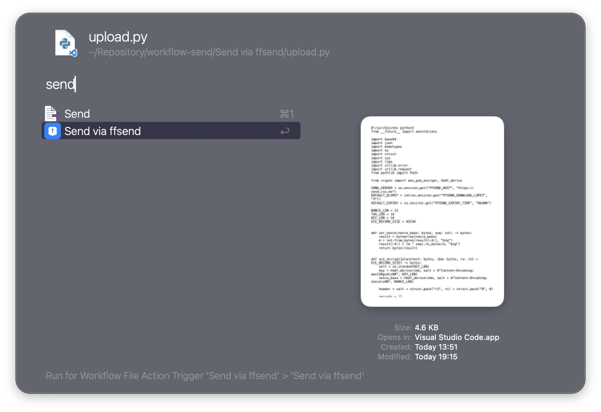

# Send via ffsend

Upload files to any [ffsend](https://github.com/timvisee/send) compatible server with end-to-end encryption. Files are encrypted client-side and the shareable link is copied to your clipboard.

## Usage

Upload files via the Universal Action or a File Action in Finder.

* <kbd>↩</kbd> Upload file and copy encrypted share link to clipboard.

## Workflow Configuration

The server URL, download limit, and expiry time can be configured in the Workflow's Configuration.
